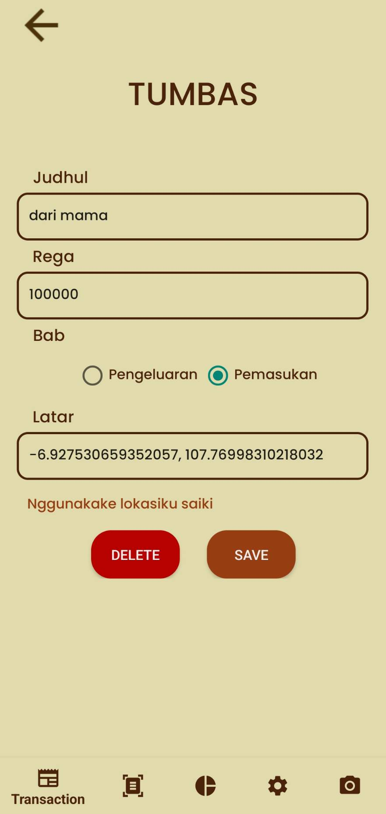

# IF3210-2024-Android-IYH

## Bondoman
Bondoman adalah sebuah aplikasi berbasis Android yang dikembangkan untuk mencatat alur keuangan seseorang. Aplikasi ini memiliki berbagai macam fitur, seperti menambah, mengedit, dan menghapus transaksi, membuat transaksi berdasarkan lokasi pengguna, menampilkan graf yang sudah dikelompokkan berdasarkan kategori, melakukan scan untuk input transaksi, dapat meng-export kegiatan transaksi menjadi .xlsx atau .xls, dan mengirim rekap transkasi ke email berupa .xlsx atau .xls.

## Library
- Retrofit
- Room
- Camera
- poi
- Security
- Navigation

## Screenshots
### Splashscreen  

### Login  

### CRUD Transaksi  

### Scan  

### Graph  

### Settings  

### Twibbon  

## Pembagian Kerja
| NIM      | Nama                   | Task                                                             |Total Jam                           |
|----------|------------------------|------------------------------------------------------------------|------------------------------------|
| 13521006 | Azmi Hasna Zahrani   |Login, Logout, Graf, Expiry JWT, Randomize Transaksi     |10 jam persiapan + 60 jam pengerjaan |
| 13521013 | Eunice Sarah Siregar        | Header, Navbar, Penambahan, Pengubahan, dan Penghapusan Transaksi, Network Sensing               |10 jam persiapan + 50 jam pengerjaan |
| 13521027 | Agsha Athalla Nurkareem            |Melihat Daftar Transaksi, Scan Nota, Menyimpan Daftar Transaksi dalam Format .xlsx, .xls, Gmail |10 jam persiapan + 60 jam pengerjaan |